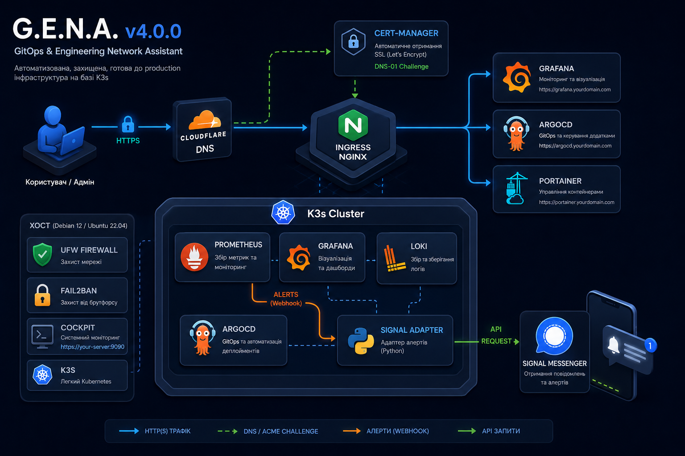
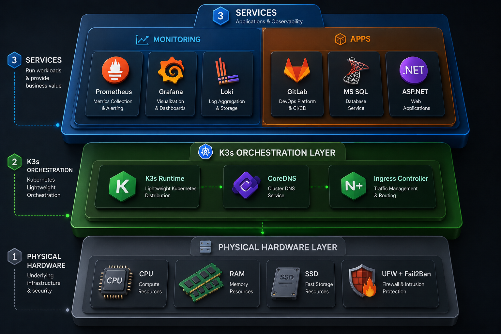

# 🚀 G.E.N.A. (GitOps & Engineering Network Assistant) v4.0.0

**G.E.N.A.** — це автоматизований bash-скрипт для розгортання захищеної, готової до production (Enterprise Hardened) single-node інфраструктури на базі **K3s**. Платформа включає повний стек моніторингу, автоматичне управління SSL-сертифікатами, GitOps (ArgoCD) та унікальну систему маршрутизації алертів у месенджер **Signal**.

Ідеально підходить для розгортання pet-проєктів, edge-серверів, локальних лабораторій та закритих мереж.

---

## 🏗 Архітектура платформи

Архітектура побудована за принципами мікросервісів та розділення відповідальності. Нижче наведено дві схеми, які детально пояснюють логіку роботи платформи.

### 🔄 Взаємодія компонентів та маршрутизація
На цій схемі зображено, як користувацький трафік проходить через DNS до кластера, а також як внутрішні сервіси (моніторинг) взаємодіють між собою для генерації та відправки сповіщень у Signal.

  

### 🥪 Рівнева схема інфраструктури
Платформа чітко розділена на фізичний рівень (ОС та безпека), рівень оркестрації (K3s, Ingress) та рівень сервісів (моніторинг та користувацькі додатки).

  

---

## 📚 Документація проекту

Для детального вивчення платформи використовуйте наступні посібники:
* 🚀 **[Інструкція з інсталяції та розгортання](docs/install.md)**
* 📖 **[Посібник користувача (Як деплоїти додатки)](docs/usage.md)**
* 🧰 **[Адміністрування та Траблшутинг (UI та CLI)](docs/troubleshooting.md)**